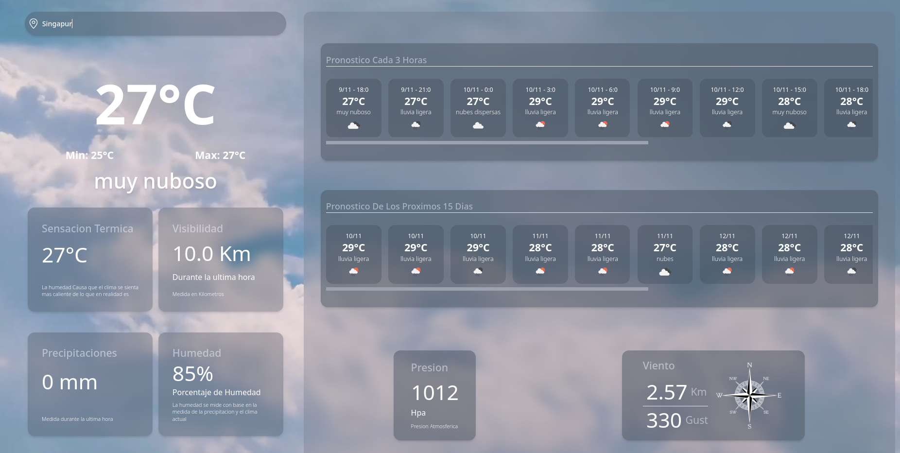

# Demo 


# Installation Commands

All commands are run from the root of the project, from a terminal:

| Command        | Action                                |
| :------------- | :------------------------------------ |
| `npm install`  | Installs dependencies                 |
| `yarn install` | Installs dependencies if you use yarn |

# How tu run

- FIrst create an account in https://openweathermap.org and generate a api token
- Then copy .env.example as .env
- Finally run in localhost using:

```bash

yarn dev

# or using npm

npm run dev

```

# Created with

1. Astro Starter Kit: Minimal
2. React
3. Tailwind
4. Zustand

## 🚀 Project Structure

Inside of your Astro project, you'll see the following folders and files:

```text
/
├── public/
├── src
│   ├── atoms
│   │   ├── InfoCard.jsx
│   │   ├── SearchBar.jsx
│   │   ├── UvCard.jsx
│   │   ├── WeatherCard.jsx
│   │   └── WindCard.jsx
│   ├── env.d.ts
│   ├── hooks
│   │   ├── useGeolocationStore.js
│   │   └── useWeather.js
│   ├── molecules
│   │   └── WeatherCarrusel.jsx
│   ├── organism
│   │   ├── ExtraWeaterInfo.jsx
│   │   └── WeatherInfo.jsx
│   └── pages
│       └── index.astro
└── package.json
```

Astro looks for `.astro` or `.md` files in the `src/pages/` directory. Each page is exposed as a route based on its file name.

There's nothing special about `src/components/`, but that's where we like to put any Astro/React/Vue/Svelte/Preact components.

Any static assets, like images, can be placed in the `public/` directory.
